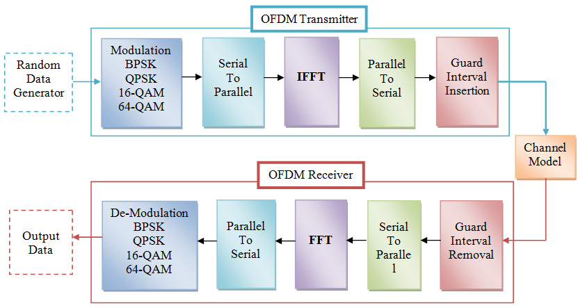
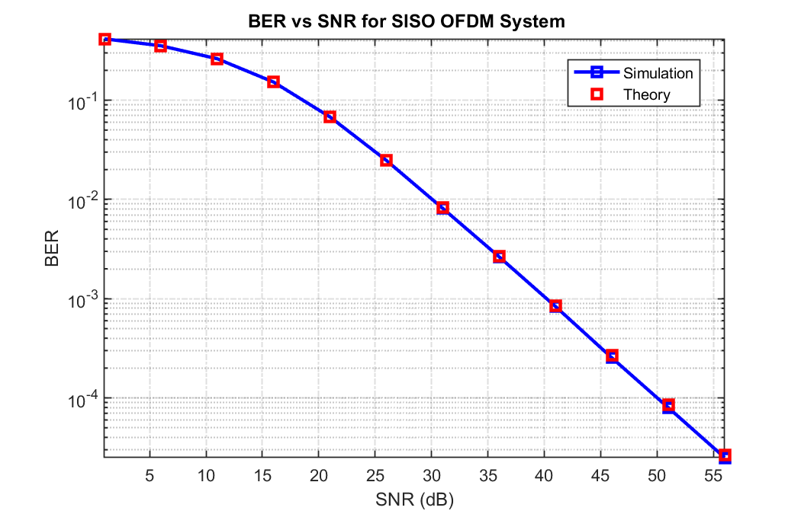
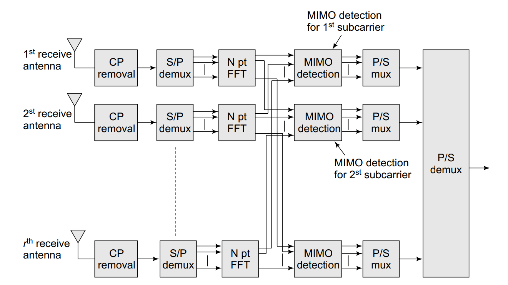
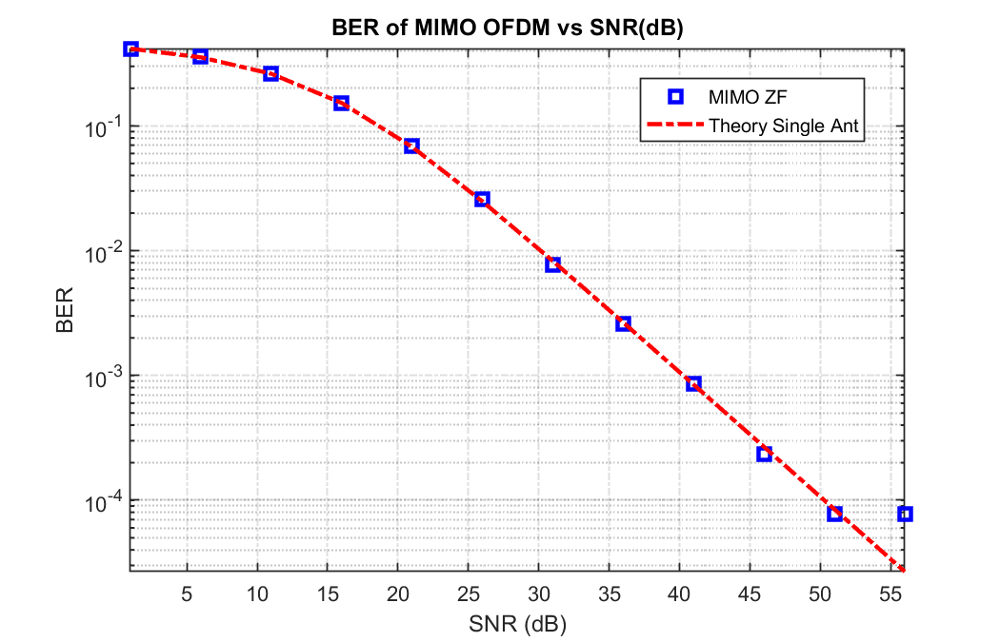
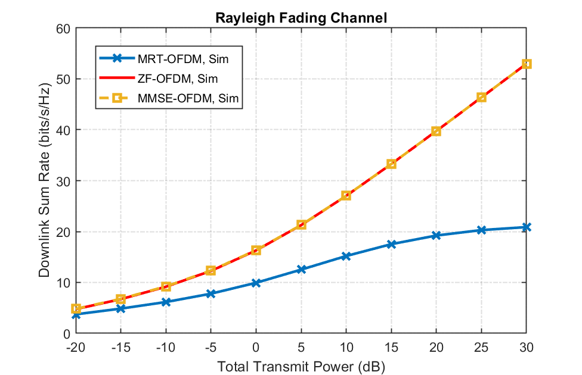
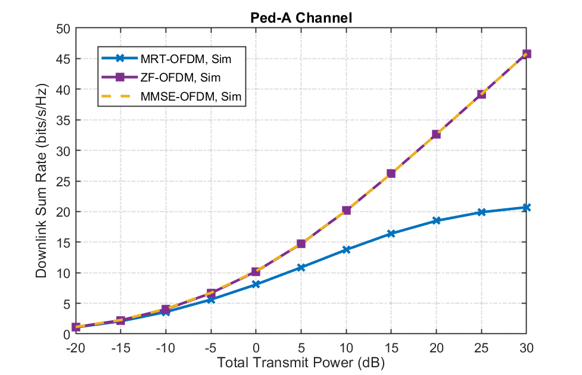
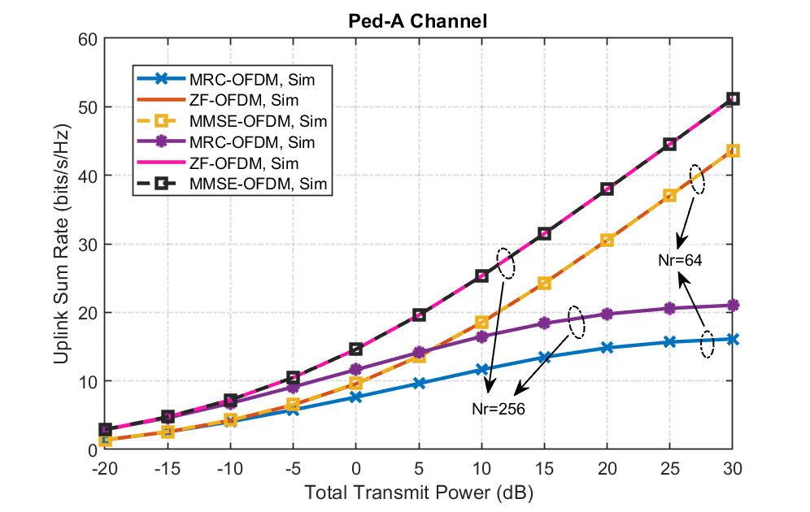

# OFDM-System

## Single-Input-Single-Output OFDM System


Total number of sub-carriers is $M$. Hence total number of information symbols is also $M$.


$$X(0) , X(1) , X(2) ,\space.\space .\space .\space.\space ,X(M-1)$$


So basically $u$-th IFFT coefficient of the information symbols $X(0) , X(1) , X(2) ,\space.\space .\space .\space.\space, X(M-1)$ is given as-


```math
    x(u) = \underbrace{\sum_{i} X(i) e^{2\pi\frac{iu}{M}}}_{IFFT}
```

Similarly $x(0),x(1),\space.\space .\space .\space.\space,x(M)$ are the IFFT coefficient at the $0,1,\space.\space .\space .\space.\space,M$ time points respectively. Our serial signal is given as-


```math
    \hat{x} = [x(0),x(1),x(2),\space.\space .\space .\space.\space,x(M)]
```


- Cyclic Prefix in OFDM -

Consider a frequency-selective channel modelled with channel taps $h(0),h(1),\space.\space .\space .\space.\space,h(L_h-1)$. Thus, the received symbol $y$ at a given time instant $n$ can be
expressed as  


```math
    y(n)=h(0)x(n)+\underbrace{h(1)x(n-1)+h(2)x(n-2)+\space.\space .\space .\space.\space+h(L_h-1)x(n-L_h+1)}_{ISI \space Component}
```


Consider now two OFDM symbols as follows. Let $x (0)$ , $x (1)$ , . . . . ., $x (M − 1)$ denote the IFFT samples of the modulated symbols $X(0)$ , $X (1)$ , . . . . . , $X (M − 1)$, while $\tilde{x}(0)$ , $\tilde{x}(1)$ , . . . . . , $\tilde{x}(M − 1)$ denote the IFFT samples of the previous modulated symbol block $\tilde{X}(0)$ , $\tilde{X}(1)$ , . . . . . , $\tilde{X}(M − 1)$. Thus, the samples corresponding to these two blocks of OFDM symbols are transmitted sequentially as


```math
    \underbrace{\tilde{x}(0) , \tilde{x}(1) , \space.\space .\space . \space, \tilde{x}(M − 1}_{Previous \space block} \space, \space \underbrace{x (0) , x (1) , \space.\space .\space .\space , x (M − 1)}_{Current \space block}
```


```math
    y(0)=h(0)x(0)+\underbrace{h(1)\tilde{x}(M-1)\space+\space .\space .\space .\space.\space\space+\space h(L_h-1)\tilde{x}(M-L_h+1)}_{ISI \space from \space the \space previous \space OFDM \space symbol}
```


```math
    y(1)=h(0)x(1)+h(1)x(0)+\underbrace{h(2)\tilde{x}(M-1)\space+\space .\space .\space .\space.\space\space+\space h(L_h-1)\tilde{x}(M-L_h+2)}_{ISI \space from \space the \space previous \space OFDM \space symbol}
```


Let us now consider a modified transmission scheme as follows. To each transmitted OFDM sample stream, we pad the last $L_c$ symbols to make the transmitted stream as follows.


```math
    \underbrace{\tilde{x}(0) , \tilde{x}(1) , \space.\space .\space . \space, \tilde{x}(M − 1}_{Previous \space block} \space, \space \underbrace{x (M-L_c) , x (M-L_c+1) , \space.\space .\space .\space , x (M − 1)}_{Cyclic \space prefix} \space, \space \underbrace{x (0) , x (1) , \space.\space .\space .\space , x (M − 1)}_{Current \space block}
```


Consider now the received symbol corresponding to $x (0)$. This is given as


```math
    y(0)=h(0)x(0)+\underbrace{h(1)x(M-1)\space+\space .\space .\space .\space.\space\space+\space h(L_h-1)x(M-L_h+1)}_{ISI \space from \space the \space same \space OFDM \space symbol}
```


The inter-symbol interference can be seen to now be from $x (M − 1) , x (M − 2) , . . . , x (M − L + 1)$, if $L_c ≥ L − 1$. Thus, with the cyclic prefix of appropriate length, i.e., $L_c ≥ L − 1$, inter-OFDM symbol interference can be avoided and inter-symbol interference is restricted to samples from the same OFDM symbol. Therefore, the samples $y (0) , y (1) , . . . , y (M − 1)$ are given as


```math
    y (0) = h (0) x (0) \space+ \space h (1) x (M − 1) \space+ \space .\space . \space . \space+ \space h (L − 1) x (M − L + 1)   
```


```math
    y (1) = h (0) x (1) \space + \space h (1) x (0) \space+ \space \space .\space . \space . \space+ \space h (L − 1) x (M − L + 2)
```


```math
                            . \space . \space . \space . \space .
```


```math
    y (N − 1) = h (0) x (M − 1) \space + \space h (1) x (M − 2) \space + \space .\space . \space . \space + \space h (L − 1) x (M − L)
```


It can now be clearly seen that the output $y (n)$ is a circular convolution between the channel filter $h (n)$ and the input $x (n)$.


```math
    [y (0) \space,\space y (1)  \space,\space . \space . \space .  \space,\space y (M − 1)] = [h (0)  \space,\space h (1)  \space,\space . \space . \space .  \space,\space h (L − 1)  \space,\space 0  \space,\space . \space . \space .  \space,\space 0] \ast_N \space [x (0)  \space,\space
x (1)  \space,\space . \space . \space .  \space,\space x (M − 1)]
```


where $\ast_M$ denotes circular convolution of modulo $N$. Therefore, the output $y$ can be written as-


```math
    y = h \ast_M x
```


Therefore, taking the FFT of $y (n)$ at the output, we have


```math
    Y (k) = H (k) \space X (k) \space \space \space , \space \space \space 0 ≤ k ≤ M − 1
```


Thus, the frequency-selective fading channel is converted into a group of narrowband flat-fading channels, one channel across each subcarrier. Observe that if a single carrier system was used, and the symbols $X (0) \space , \space X (1) \space , \space . \space . \space . \space , \space X (M − 1)$ were transmitted directly then the received symbol $y (n)$ would be given as


```math
    y (n) = h (0) X (n) \space + \space h (1) X (n − 1) \space + \space . \space . \space . \space + \space h (L − 1) X (n − L + 1)
```


Each symbol $X (n)$ would experience inter-symbol interference of $L − 1$ past symbols. Therefore, using this novel scheme of OFDM, we have been able to totally eliminate the inter-symbol interference arising out of the frequency-selective nature of the channel. The set of parallel flat-fading channels can be summarized by the expressions -


```math
    Y (0) = H (0) \space X (0)
```


```math
    Y (1) = H (1) \space X (1)
```


```math
    . \space \space \space \space \space \space \space \space \space . \space \space \space \space \space \space \space \space \space .
```


```math
    . \space \space \space \space \space \space \space \space \space . \space \space \space \space \space \space \space \space \space .
```


```math
    Y (M-1) = H (M-1) \space X (M-1)
```


Now, considering the noise at the receiver, the received symbol $Y (k)$ can be expressed as -


```math
    Y (k) \space = \space H (k) \space X (k) \space + \space N (k)
```


A simple detection scheme for $X (k)$ is to use the zero-forcing detector for the subcarrier as


```math
    \hat{X}(k) = \frac{1}{H (k)}\space Y(k) = X(k) \space + \space \underbrace{\frac{N(k)}{H(k)}}_{\tilde{N}(k)}

```


Coherent or matched filter detection - 


```math
    H^{\ast}(k) \space Y(k) = |H(k)|^2 \space X(k) \space + \space \underbrace{H^{\ast}(k)\space N(k)}_{N'(k)}
```


Also, one can employ the MMSE detector as


```math
    \hat{X}_{MMSE}(k) = \frac{H^{\ast}(k)}{|H(k)|^2  + \sigma^{2}_{\eta}}Y(k) 
```


- BER Calculation:


Consider the OFDM subcarrier system model given as - 


```math
    Y (k) \space = \space H (k) \space X (k) \space + \space N (k)
```


where $N (k)$ is the subcarrier noise obtained from the FFT of the noise samples at the output of the receiver as - 


```math
    N(k) = \sum_{i}^{M-1}n(i)e^{-2\pi\frac{k\space i}{M}} 
```


- Mean $\mathbb{E}[N(k)] = \sum_{i}\mathbb{E}[n(i)]e^{-2\pi\frac{k\space i}{M}} = 0$

- Variance $\sigma^{2}_M = \mathbb{E}[|N(k)|^2]$


```math
    \sigma^{2}_M = \sum_{m}^{M-1}\sum_{l}^{M-1}\mathbb{E}[n(m)n^{\ast}(l)]e^{-2\pi\frac{m-l}{M}}

```


```math
    \sigma^{2}_M = \sum_{m}^{M-1}\sigma^{2}_{\eta} = M\sigma^{2}_{\eta}
```


Further, let us assume that each of the channel taps $h (0) \space,\space h (1)\space ,\space . \space . \space . \space , \space h (L − 1)$ is Rayleigh fading in nature, i.e., has a complex symmetric Gaussian distribution of mean 0 and variance 1. Therefore, the channel coefficient across the $k$-th subcarrier is given as -


```math
    H(k) = \sum_{i}^{M-1}h(i)e^{-2\pi\frac{k\space i}{M}} 
```


- Mean $\mathbb{E}[H(k)] = \sum_{i}\mathbb{E}[h(i)]e^{-2\pi\frac{k\space i}{M}} = 0$

- Channel Power Gain $\mathbb{E}[|H(k)|^2] = \sum_{i}\mathbb{E}[|h(i)|^2]|e^{-2\pi\frac{k\space i}{M}}|^2 = L$


Therefore, the average $SNR$ is given as -


```math
    SNR_{aver} = \frac{LP}{M\sigma^{2}_{\eta}} 
```


Hence, the BER is given by the standard expression for that of a Rayleigh fading wireless channel as - 


```math
    BER_{OFDM} = \frac{1}{2}( 1 - \sqrt{\frac{\frac{LP}{M\sigma^{2}_{\eta}}}{2+\frac{LP}{M\sigma^{2}_{\eta}}}})
```




- Problem Statement : Simulate an OFDM wireless system in MATLAB with 𝑁 = 64 subcarriers for a channel with 𝐿 = 3 i.i.d. Rayleigh fading unit gain channel taps. Generate the BER curves vs dB SNR for BPSK symbols loaded over all the subcarriers and also superimpose the plots obtained via the corresponding analytical expression derived in class lectures. Choose the SNR range so as to obtain BER values up to 10−4.
  
- Simulation :
  




## Single-Input-Multi-Output OFDM System

- Problem Statement : Extend the above simulation to a SIMO OFDM system with 𝑅 = 2 receive antennas and similarly plot the BER curves obtained via both simulation and analysis. Submit the code and relevant plots for both the problems above.
 
- Simulation :
  


## Multi-Input-Multi-Output OFDM System

### Transmitter 


### Receiver





- Problem Statement : Simulate a MIMO OFDM wireless system in MATLAB with 𝑁 = 64 subcarriers for a channel with 𝐿 = 3 i.i.d. Rayleigh fading unit gain channel taps, 𝑡 = 2 transmit and 𝑟 = 2 receive antennas. Generate the BER curves vs dB SNR for BPSK symbols loaded over all the subcarriers and all transmit antennas. Superimpose the plots obtained via the corresponding analytical expression derived in class lectures. Choose the SNR range so as to obtain BER values up to 10−4
 
- Simulation :
  



## Massive MIMO-OFDM Downlink System

- Problem Statement : Simulate a Massive MIMO-OFDM wireless system in MATLAB with M = 32 subcarriers for a channel with 𝐿 = 5 i.i.d. Rayleigh fading unit gain channel taps and Pedestrian-A channel with gain [0 −9.7 −19.2 −22.8], N_t = 64 BS Antennas and K = 4 Single Antenna Users. Generate the both Uplink and Downlink sum rate for QAM symbols loaded over all the subcarriers and compared it for MRC,ZF,MMSE.
 
- Simulation : Rayleigh Fading Channel 





- Simulation : Pedestrian-A Channel 





## Massive MIMO-OFDM Uplink System

- Simulation : Rayleigh Fading Channel 


- Simulation : Pedestrian-A Channel 


- Simulation : Pedestrian-A Channel 



